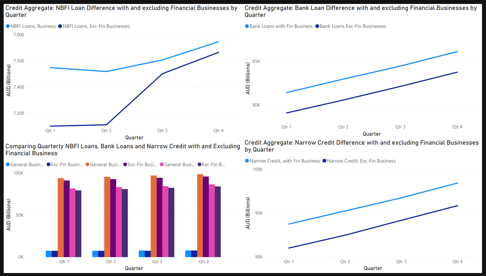
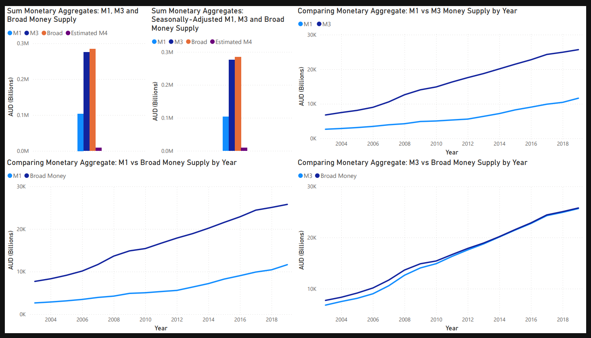

# RBA-Fiscal-Aggregates-2003-2019
This projects compares financial credit ($AUD billions) and growth aggregates (%) from the Reeserve Bank of Australia from 2003 to 2019 to examine trends in financial statistics.

-   [Overview](#overview)
-   [Project Layout](#project-layout)
-   [Analysis Steps](#analysis-steps)
-   [Sample Output](#sample-output)

## Overview
The project was built using a PostgreSQL database, SQL and Microsoft Power BI. Implementation included stripping original data to the timeframe with the cleanest data, then cleaning missing data with backward/forward substitution when needed. Results were then generated in Power BI from generated SQL queries.

The [Report](./Report.pdf) describes the full process.

## Project Layout
The project contains the following

| File/Folder                           | Purpose                                                    |
| :------------------------------------ | :----------------------------------------------------------|
| `Report.pdf`                          | Complete project report with visualisations                |
| `Crop`                                | Folder containing intermediary filtered & processed data   |
| `Queries`                             | Folder containing SQL queries for visualisations           |
| `Raw`                                 | Folder containing all raw datasets                         |
| `SQL`                                 | Folder containing SQL and PSQL code used                   |
| `Visualisations`                      | Folder containing visualisations and Power BI files        |

## Analysis Steps
The following steps were used to generate the accurate visualisations from input data.

-   Downloaded data from [Reserve Bank of Australia](https://www.rba.gov.au/statistics/tables/)
-   Stripped data to suit PostgresSQL database, then imported as.csv files
-   Stripped data for timeframe with most data (2003-2019)
-   Generated remaining missing data using substitution.
-   Generated topic-dependent analytical queries for relevant visualisations
-   Generated Power BI visualisations and dashboards
-   Implemented final report

## Sample Output
Here show some examples of tabulated data in Power BI:

 - Tables comparing business credit data aggregates with and without financial businesses: 

 - Tables comparing Types of Money (M1, M3, Broad and Speculative M4) with aggregate graph: 

